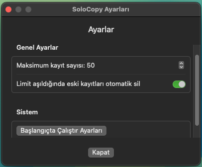

# SoloCopy

SoloCopy is a lightweight clipboard manager for macOS that lives in your menu bar. It helps you keep track of your clipboard history and quickly access previously copied items.

## Features

- 📋 Automatically saves clipboard history
- 🔍 Search through your clipboard history
- ⭐️ Star important items to keep them at the top
- 🗑️ Easy deletion of unwanted entries
- ⚡️ Quick access from the menu bar
- 🎯 Duplicate entries are automatically handled
- ⚙️ Customizable settings

## Screenshots

### Main Interface

### Settings

## Installation

1. Download the latest version from the releases page
2. Move SoloCopy.app to your Applications folder
3. Launch SoloCopy
4. (Optional) Configure SoloCopy to start at login

## Usage

### Basic Operations
- Click the clipboard icon in the menu bar to view your clipboard history
- Right-click the icon to access settings and quit option
- Use the search bar to find specific items
- Click the copy button on any item to copy it back to your clipboard

### Item Management
- Star important items to keep them at the top of the list
- Delete items you no longer need
- Items are automatically saved and persisted between app launches

### Settings
- Set maximum number of stored items (10-200)
- Enable/disable automatic deletion of old items
- Configure startup options

## System Requirements

- macOS 12.0 or later
- Apple Silicon or Intel processor

## Privacy

SoloCopy only stores text content that you copy to your clipboard. No data is sent outside of your device, and all clipboard history is stored locally on your computer.

## Keyboard Shortcuts

- `⌘,` - Open Settings
- `⌘Q` - Quit SoloCopy

## Support

If you encounter any issues or have suggestions, please open an issue on GitHub.

## License

MIT License - feel free to use and modify as you like!

---
*Note: Please replace the screenshot placeholders (screenshots/menubar.png, screenshots/main.png, screenshots/settings.png) with actual screenshots of your application.* 